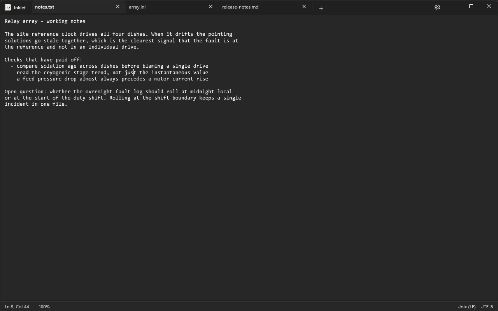
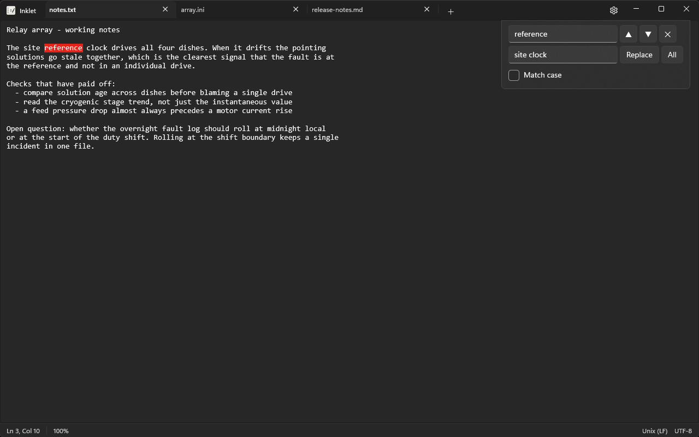
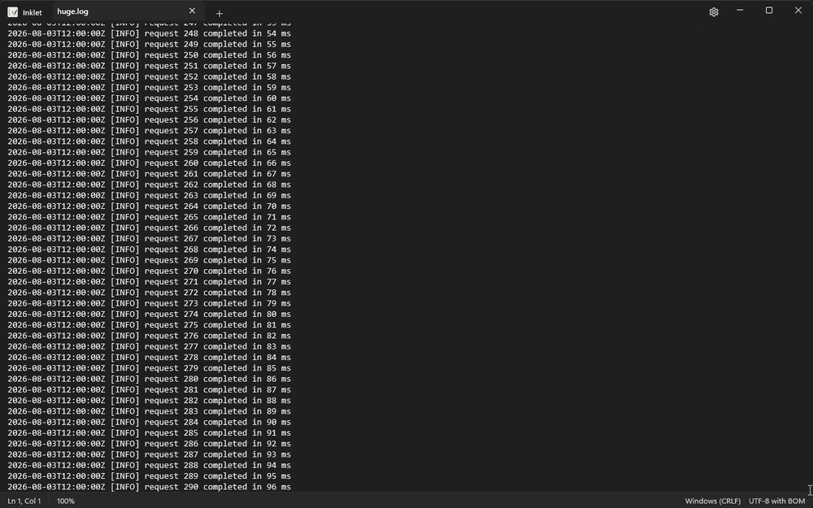

# Inklet

[](https://github.com/JAD-Apps/Inklet/actions/workflows/ci.yml)


[](LICENSE)
[](https://github.com/JAD-Apps/Inklet/releases/latest)

<p align="center">

</p>

**Status:** released and actively developed · **Latest:** v2.0.1 · **Requires:** Windows 10 1809 (build 17763) or later

A lightweight, modern Notepad clone for Windows built with WinUI 3 and .NET 8.

Inklet recreates the classic Notepad experience with modern WinUI 3 styling, Mica backdrop, and system theme support — on top of a text engine built for files of any size. Version 2.0 rewrote the engine from the ground up: documents are memory-mapped and indexed in the background, so gigabyte-sized files open instantly, typing stays under a millisecond at any size, and memory stays flat.


## Download

Grab the latest portable build from [Releases](https://github.com/JAD-Apps/Inklet/releases/latest) — unzip and run `Inklet.exe`. Self-contained, so no .NET runtime is needed.

> Builds are currently unsigned; Windows SmartScreen will warn on first run.
> Choose **More info** → **Run anyway** if you trust the source.

## Features

### File Operations
- **New** — Start a fresh document in the current tab
- **New Tab** — Open an additional editor tab (Ctrl+T)
- **Close Tab** — Close the current tab (Ctrl+W)
- **Open** — Open any text file with automatic encoding detection
- **Save / Save As** — Save with your choice of encoding (Ctrl+S / Ctrl+Shift+S)
- **Print / Page Setup** — Full Windows print support (Ctrl+P)
- **Drag & Drop** — Drop files directly onto the editor

### Edit Operations



- **Undo / Redo** — Ctrl+Z / Ctrl+Y
- **Cut / Copy / Paste / Delete** — Standard clipboard operations
- **Find & Replace** — With match-case option (Ctrl+F / Ctrl+H)
- **Find Next / Previous** — F3 / Shift+F3
- **Go To Line** — Jump to a specific line number (Ctrl+G)
- **Select All** — Select entire document (Ctrl+A)
- **Time/Date** — Insert current timestamp (F5)

### Tabs & Session
- **Multi-tab editing** — Any number of tabs open simultaneously; switching tabs is instant and each tab keeps its own undo history
- **Session persistence** — Open files, cursor positions and unsaved work are restored on next launch. File-backed tabs persist *edit deltas* rather than full text, so a gigabyte file with a few edits stores in about a kilobyte
- **Tab headers** — `*` prefix indicates unsaved changes; undoing back to your last save clears it

### Format
- **Word Wrap** — Toggle word wrap on/off
- **Font** — Choose font family, style, and size

### View
- **Status Bar** — Line/column position, encoding, line ending, zoom level
- **Zoom** — Ctrl+Scroll, Ctrl+Plus/Minus, or View › Zoom menu (25%–500%)

### Encoding Support
- UTF-8 (with and without BOM)
- UTF-16 LE / BE
- ANSI (system default)
- Auto-detection of file encoding including international code pages
- Extensive code page support (Shift-JIS, GB2312, ISO-8859-x, and more)

### Line Endings
- Windows (CRLF)
- Unix (LF)
- Classic Mac (CR)
- Automatic detection and display in status bar

### Performance



The 2.0 engine holds documents as a piece tree over a memory-mapped file — the
file is never fully loaded, and every interactive operation is proportional to
the viewport, not the document. Measured on the 64-bit build
(see `docs/perf/launch.md` for protocols and full results):

- **Open**: a 10 GB, 113-million-line log shows its first page ~60 ms after the document opens; a background index makes line counts, Go To and search exact within seconds (progress in the status bar)
- **Typing**: p50 under 1 ms whether the file is 1 KB or 10 GB
- **Navigation**: Ctrl+End across 113 million lines in ~60 ms; Go To line 50,000,000 is instant
- **Memory**: ~150–300 MB of private memory regardless of file size
- **Saving**: atomic (temp file + swap) and byte-exact — unedited regions are copied back identically, mixed line endings preserved; a 10 GB save is limited only by disk speed
- **Find & Replace**: runs in the background over an immutable snapshot; the window never freezes, and Replace All is a single undo step
- Correct text handling everywhere: CJK, emoji, tabs and proportional fonts position exactly in hit-testing, selection and caret placement
- IME (East-Asian composition) input via `CoreTextEditContext`, composing and committing inline at the caret
- Mica backdrop behind the title bar and tabs

> Notes: the 32-bit (x86) build cannot memory-map large files and is limited to
> 256 MB per file. Not yet implemented: screen-reader (UIA) accessibility — a
> planned follow-up.

### File Associations
- Registers as an "Open With" handler for common text formats: `.txt`, `.log`, `.ini`, `.cfg`, `.md`, `.xml`, `.json`, `.csv`, `.yaml`, `.yml`

## Requirements

- Windows 10 version 1809 (build 17763) or later
- Windows 11 supported

## Building

1. Open `Inklet.slnx` in Visual Studio 2022 17.8+ or Visual Studio 2026
2. Set **Inklet (Package)** as the startup project
3. Build and run (F5)

> Default editor font is Consolas 14 pt.

## Testing

```bash
dotnet test Inklet.Tests -c Debug -p:Platform=x64
```

The default run (~210 tests) includes randomised oracle equivalence tests,
byte-identity save round-trips, and performance guards against a generated
256 MB corpus. An opt-in 8 GB tier runs with `INKLET_HUGE_TESTS=1` and
`--filter "TestCategory=HugeFiles"`. Perf scripts for the real app live in
`Scripts/` (`Measure-Launch.ps1`, `Measure-Typing.ps1`, `New-TestCorpus.ps1`).

## License

Inklet is **source-available, not open source**, under the
[PolyForm Noncommercial License 1.0.0](LICENSE).

You may read, build and modify the source for any noncommercial purpose.
Commercial use — including redistribution, resale, or publishing to an
application store — is reserved to JAD Apps. For a commercial licence,
get in touch via [jadapps.app](https://jadapps.app).

© 2026 John Donnelly, trading as JAD Apps.

## Privacy

Inklet collects no data. See [PRIVACY_POLICY.md](PRIVACY_POLICY.md) for details.

## Author

John Donnelly — [JAD Apps](https://github.com/JAD-Apps)

© 2025 JAD Apps. All rights reserved.


